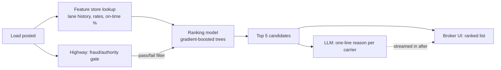

# Part 3 — System Design: Carrier Match

## 1. Data sources and features

**DAT / Truckstop (load boards)** — mostly market context, not relationship
history: is this carrier currently posting available trucks near the lane
(are they even looking for freight right now), how often they post in this
lane generally, and a market rate benchmark for the lane/equipment so we can
tell whether our posted rate is competitive before we even call anyone.

**Highway** — carrier identity and fraud signals: active authority, insurance
on file, and any fraud/double-brokering flags. This isn't a ranking input,
it's a gate. A carrier that fails this check shouldn't show up in the top 5
at all, no matter how good the lane match is — mixing a compliance check into
a fuzzy ranking score is how a fraud signal quietly gets outvoted by a good
rate history.

**QuickBooks + our own load history** — this is where the real signal is,
for carriers we've worked with before: lane history (have they hauled this
lane or something close to it), equipment match, historical rate
acceptance/negotiation pattern, on-time pickup/delivery rate, no-show rate,
and any payment/billing disputes on file. This is the strongest predictor of
"will they cover this load at a good rate," but it only exists for carriers
we already have a relationship with — see cold start below.

**Derived features**: lane-pair frequency, rate elasticity (do they usually
accept the first offer or negotiate up), how recent their last known capacity
signal was, and a rough deadhead estimate if we have their last known
position from a load board posting.

## 2. Where LLMs help, and where they don't

The core of this problem — given a set of candidate carriers and a load,
predict likelihood of covering it at a good rate — is a numeric ranking
problem over structured features with real historical labels (did they
accept, at what rate, did they perform). That's a job for a gradient-boosted
tree model (LightGBM/XGBoost) or a similar learning-to-rank setup, not an
LLM. An LLM has no particular advantage at predicting "will carrier X accept
$1,800 on this lane" over a model trained on our own acceptance history, and
it's slower, more expensive, and harder to audit for something this
numeric.

Where an LLM does earn its place:
- Keeping the underlying feature store clean — this is basically Part 1's
  extraction pipeline feeding lane/rate/equipment data in from rate cons and
  carrier packets, so the ranking model has real structured data to work
  from.
- Turning the ranking into something a broker can act on quickly — a
  one-line reason per suggested carrier ("hauled this lane 9 of the last 12
  times we called, usually within 5% of posted rate") is a natural-language
  summarization task over already-computed features, not a prediction task.
- Handling messy qualitative signal that doesn't fit neatly into features —
  e.g., a dispatcher's note from a past email ("no NYC deliveries after
  6pm") — that's better pulled out by an LLM than hand-built into a feature
  schema.

Where I'd deliberately keep it classical/rule-based:
- The fraud/authority gate from Highway — deterministic, auditable, no
  fuzziness allowed in a compliance-adjacent check.
- The core ranking score — cheap, fast, and debuggable in a way an LLM call
  isn't when a broker asks "why wasn't carrier Y suggested."
- Deadhead/distance — plain geospatial math.

## 3. Cold start for a new brokerage

A brand-new brokerage has no relationship history, so the relationship-based
features (acceptance rate, on-time %, past disputes) are all empty. The
model shouldn't just guess in that gap — it should fall back to
brokerage-agnostic features that don't need our own history: the lane's
market rate benchmark, the carrier's general activity level in that lane
from load board data, and the Highway fraud/authority score, all of which
exist independent of whether *this* brokerage has ever called *this*
carrier.

Concretely, I'd treat the score as a blend: `score = w_market * market_score
+ w_relationship * relationship_score`, where `w_relationship` starts at (or
near) zero for a new brokerage and increases as their own call/booking
volume accumulates. That avoids a sharp "cliff" the day a brokerage crosses
some arbitrary history threshold, and it degrades gracefully back to the
market-only score for any carrier they simply haven't worked with yet, even
if the brokerage itself is established.

Separately, if a brokerage is migrating from another TMS or a spreadsheet,
letting them import a carrier list up front (MC numbers, informal notes) is
a cheap way to skip some of the cold start rather than relying purely on
inference.

## 4. Latency, cost, and caching

This needs to feel instant to a broker who just posted a load, so the
latency budget is tight — low seconds at most for something blocking their
workflow. The ranking model itself isn't the bottleneck; a gradient-boosted
tree does inference in single-digit milliseconds. The actual cost is in the
supporting data:

- **Carrier feature vectors** (lane history, acceptance rate, on-time %)
  shouldn't be computed live per load posting — they're precomputed and
  refreshed on a schedule (nightly batch, or triggered on new load
  completion) and served from a feature store.
- **Highway fraud/authority status** is cached with a TTL rather than
  queried live every time, since it changes rarely — but not cached
  indefinitely, since a newly suspended authority needs to propagate in a
  reasonable window. A short TTL (or a webhook if Highway supports one) is
  the right trade-off given the compliance stakes.
- **DAT/Truckstop market rate benchmarks** move day to day, not minute to
  minute, so caching per lane+equipment+day is enough.
- **The LLM step is the one live call**, and it's the cheapest part of the
  pipeline to reason about cost-wise: it's a single, small, fixed-size
  summarization call over the already-ranked top 5, not a call per
  candidate carrier and not part of the ranking decision itself. I'd make it
  non-blocking — show the ranked list immediately from the (fast) classical
  model, and stream in the one-line explanations a moment later, so no
  broker is waiting on an LLM response just to see who to call.
